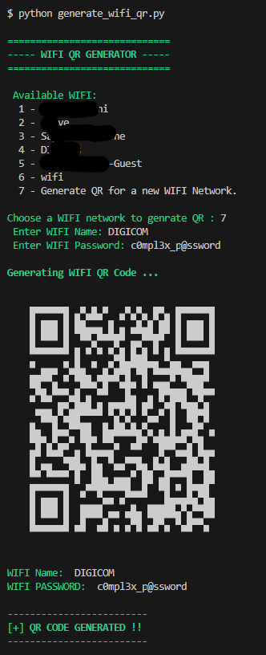

# WIFI QR Generator

Generate WIFI QR for already connected networks as well as for custom network names with passwords.

## Requirements

```bash
pip install -r requirements.txt
```

## Command

```bash
python generate_wifi_qr.py
```



QR Image saved as : [wifi_qr.png](./wifi_qr.png)
